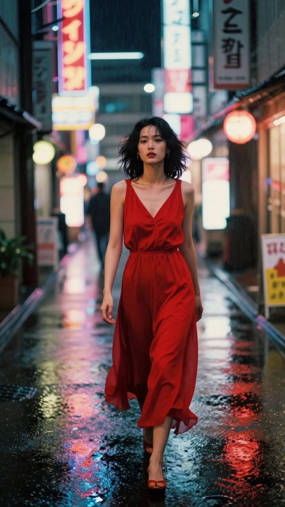

# Design Library

<p align="center">
  
  <br>
  <em>Generated with Image Studio: <code>--style yoji-shinkawa --director kurosawa --film-stock tri-x --lighting golden-hour</code></em>
</p>

> A structured reference library for working with LLM coding assistants on design tasks. Distilled designer style profiles, composition principles, and project history — organized so an AI assistant (Claude, GPT, local LLMs) can read relevant context on demand.

**Not a training dataset in the machine-learning sense.** It's a **retrieval library** — purpose-built markdown files that an LLM reads at runtime to produce grounded, style-aware design work. Think moodboard + style guide + tactical instructions, rendered as parseable text.

## Why this exists

Vanilla LLMs, asked to "design a cyberpunk poster," produce generic cyberpunk — the average of everything in their training data. To get work in the voice of **a specific designer** (Ash Thorp minimalist, Kilian Eng retrofuturist, David Carson chaos-typography), you need references the model can actually consult.

This library is the references, written in a format LLMs read well:
- **Source indexes** — portfolio URLs (single source of truth)
- **Style profiles** — distilled tactical rules for applying a style
- **Principles** — universal design knowledge (color, typography, composition)
- **Work history** — past projects for consistency and evolution

## How it works

```
User:   "Design a festival poster in the style of Kilian Eng."
Claude: reads style-profiles/kilian-eng.md
        → extracts palette, composition tactics, signature moves
        → generates work following those rules
        → saves to my-works/YYYY-MM-project-name/
```

The tactical rules in each style profile are written for an LLM to **actually follow**, not just read:
- Exact hex codes per role
- Typography specs (weight, tracking, size relative)
- Composition patterns ("horizon-anchored, 40% negative space")
- Things to use + things to avoid (explicit negative rules)

## Repository structure

```
design-library/
├── SETUP.md                   # how to use (detailed workflow)
├── README.md                  # you are here
├── CONTRIBUTING.md            # how to add designers / principles
├── TRAINING.md                # how to extend + thoughts on real ML training
├── LICENSE                    # MIT
│
├── sources/                   # source-of-truth: links + metadata
│   ├── designers/             # one .md per designer with portfolio URLs
│   ├── collections/           # curated resource libraries (Envato, Canva, Behance)
│   └── principles/            # universal design knowledge
│
├── style-profiles/            # MAIN WORK ZONE — distilled tactical profiles
│                              # this is what Claude reads at composition time
│
├── analyses/                  # breakdowns of specific works (filled on demand)
│
├── my-works/                  # projects built using the library
│
├── tools/                     # CLI tools for image generation
│   ├── generate.py            # main CLI: style-aware AI image generation
│   ├── prompt_builder.py      # style profile parser + prompt builder
│   └── requirements.txt       # Python dependencies
│
└── templates/                 # templates for new entries
```

## Current inventory (v1.2.0)

**14 designers** across genres:

| Designer | Genre | Best for |
|---|---|---|
| Ash Thorp | Cinematic UI, atmospheric illustration | Cold atmospheric tech, BR2049 vibes |
| Josan Gonzalez / Death Burger | Dense cyberpunk editorial | Maximalist packed cyberpunk illustration |
| James White / Signalnoise | 80s retrofuturism, synthwave | Nostalgic optimism, sunset gradients |
| Syd Mead | Legacy industrial concept art | Painterly gravitas, realistic futurism |
| Beeple | 3D satirical daily-art | Cultural commentary, absurd 3D |
| Kilian Eng | Retrofuturism + engraving + dark fantasy | Warm nostalgic sci-fi posters (Mondo) |
| Yoji Shinkawa | Sumi-e ink + mecha | Traditional Japanese ink, high contrast |
| David Carson | Chaos typography, anti-design | Anti-grid rebellion, emotional layouts |
| Stefan Sagmeister | Concept-first brand | Big ideas via unusual materials |
| **Paula Scher** | Type-forward editorial maximalism | "Loud but literate" — cultural institutions |
| **Kenya Hara** | Japanese modern minimalism (Muji) | Quiet premium, breathing-room design |
| **Peter Saville** | Cerebral minimalism via appropriation | Record sleeves / thinking-object aesthetic |
| **Massimo Vignelli** | Swiss modernism systems | Wayfinding, institutional identity |
| **Refik Anadol** | Generative / AI-collab art | Machine-imagination at architectural scale |

**3 deep analyses:** Thorp GITS UI, Shinkawa MGS5 Sahelanthropus, Carson Ray Gun spread
**3 collections:** Envato Elements index, Canva favorites, Behance cyberpunk (templates)
**3 principles:** color theory, typography hierarchy, composition & grids
**8 showcase works + 1 synthesis test:** `my-works/showcase-2026-04/` validates profiles produce legibly distinct outputs

## Scope — what this library is and isn't for

The library is **medium-agnostic in principle** (it describes visual design approaches) but **Adobe Illustrator-first in practice** (Claude generates SVG, which opens natively in Illustrator with editable named layers). Here's the honest breakdown of what workflows it supports.

### Where it works directly (Claude outputs a usable file)

| Tool | What you get | Workflow |
|---|---|---|
| **Adobe Illustrator** | SVG with named layers → Save As `.ai` | Primary supported path. All 8 showcase pieces follow this. |
| **Figma / vector web design** | SVG imports cleanly with layer structure preserved | Drag SVG into Figma; refine with Figma's vector tools |
| **SVG for web** | `.svg` renders in browsers directly | Works as-is or inline in HTML |
| **Canva** (via MCP) | Profile text seeds AI design generation | Paste tactical rules into Canva's generate-design prompt |

### Where it works as guidance (you execute manually)

| Tool | What the library provides | Execution |
|---|---|---|
| **Adobe Photoshop** | Hex palette with role %, typography specs, composition rules, signature moves | You paint / composite manually. Profiles reference Photoshop mastery (Thorp, Beeple, Kilian Eng, Shinkawa) but Claude can't generate `.psd`. |
| **Cinema 4D / Blender / 3D** | Aesthetic direction, palette, compositional intent | You model, light, render. Beeple/Thorp work started in 3D — Claude describes approach, not files. |
| **After Effects / motion** | Visual language direction | Motion execution is yours; Claude's output is static. |
| **Physical print / letterpress / paper craft** | Principles + reference | Sagmeister paper-cut, Shinkawa brush-and-ink, Kilian Eng print work — profile describes; your hands (or collaborators) execute. |
| **Procreate / digital painting** | Palette + typographic/compositional direction | You paint per guidance. |

### Where it doesn't work

- **Replacing a designer.** The library raises the floor on AI-generated design output. It does not lift the ceiling past generalist-LLM + vector-tool capability.
- **Pixel-level style match.** If you need output that visually matches a specific designer's hand at pixel level (i.e. for Kilian Eng's screenprint feel or Beeple's C4D glossy rendering), you need image-gen models (Flux / SDXL) with LoRA fine-tuning. See [TRAINING.md](TRAINING.md).
- **Direct-to-production work.** Everything Claude generates here is a **starting point**. Expect to refine in your actual design tool.

### TL;DR

If you work in **Adobe Illustrator** → library delivers editable SVG → `.ai` files directly. This is the flagship use case.

If you work in **Adobe Photoshop / 3D / motion / print / physical craft** → library delivers tactical direction (palette, typography, composition, signature moves) for you to execute by hand. Library is the briefing; you are the production.

All 8 showcase pieces in `my-works/showcase-2026-04/` are SVG → AI workflow. See the [showcase README](my-works/showcase-2026-04/README.md) for a 9-dimension comparison of what the direct-output path produces.

## Getting started

### 1. Fork + clone
```bash
gh repo fork <this-repo> --clone
cd design-library
```

### 2. Point your LLM at it
With Claude Code, Cursor, or any LLM with filesystem access:

**Option A — Direct reference** (simplest)
```
"Read ~/path/to/design-library/style-profiles/ash-thorp.md and
 design a poster in that style for a [topic] event."
```

**Option B — Memory pointer** (for Claude Code users)
Add a reference memory entry pointing to the library so it's auto-loaded on design tasks:
```markdown
---
name: Design Library
type: reference
---
Location: ~/Documents/design-library/
Read style-profiles/*.md when user asks for design work in a designer's style.
```

**Option C — Agent skill** (advanced, Claude Code)
Create a custom skill that auto-triggers on design-related prompts and reads the library.

### 3. Request design work
```
"Design a synthwave concert poster in the style of James White (Signalnoise).
 Combine with Kilian Eng's screen-print texture sensibility.
 Save to my-works/."
```

The LLM reads both style profiles, synthesizes their tactical rules, generates output.

## Image Studio — AI image generation tools

The `tools/` directory is a style-aware AI prompt builder and image generator. It reads designer style profiles from this library and combines them with cinematography parameters (directors, cameras, lighting, film stocks, lenses, filters) to produce enhanced prompts or actual images via API.

**417 total options** across 11 categories — comparable to commercial tools like RenderZero Studio, but open-source and integrated with designer style profiles.

### What's in the toolbox

| Category | Count | Flag | Example |
|----------|-------|------|---------|
| Designer styles | 14 | `--style` | `ash-thorp`, `kilian-eng`, `kenya-hara` |
| Directors | 99 | `--director` | `kubrick`, `wong-kar-wai`, `tarkovsky` |
| Photographers | 99 | `--photographer` | `annie-leibovitz`, `fan-ho`, `liam-wong` |
| Cameras | 47 | `--camera` | `arri-alexa`, `hasselblad-500`, `polaroid-sx70` |
| Lighting | 43 | `--lighting` | `chiaroscuro`, `golden-hour`, `neon` |
| Shot types | 26 | `--shot` | `close-up`, `wide`, `dutch`, `worms-eye` |
| Lens types | 12 | `--lens-type` | `anamorphic`, `petzval`, `tilt-shift` |
| Film stocks | 28 | `--film-stock` | `portra-400`, `cinestill-800t`, `tri-x` |
| Filters | 44 | `--filter` | `grain`, `bokeh`, `chromatic`, `risograph` |
| Focal lengths | 9 | `--focal-length` | `35`, `85`, `200` |
| Camera moves | 19 | `--camera-move` | `dolly-in`, `orbit-right`, `steadicam` |

### Quick start

```bash
cd design-library

# 1. Browse what's available
python3 tools/generate.py --list-styles          # 14 designer style profiles
python3 tools/generate.py --list-cinema           # all 400+ cinema options
python3 tools/generate.py --list-cinema directors  # just directors (99)
python3 tools/generate.py --list-cinema filters    # just filters (44)
```

### Building prompts (no API key needed)

The core feature is **prompt building** — combining your subject with style/cinema parameters into an optimized prompt for any image generation tool (Midjourney, Nano Banana, FLUX, DALL-E, etc.).

```bash
# Basic: subject + designer style
python3 tools/generate.py "cyberpunk city at night" \
  --style ash-thorp \
  --prompt-only

# Cinema only: director + camera + film stock
python3 tools/generate.py "portrait of old fisherman, weathered face" \
  --director tarkovsky \
  --camera hasselblad-500 \
  --lighting golden-hour \
  --film-stock portra-400 \
  --shot close-up \
  --focal-length 85 \
  --prompt-only

# Full combo: designer style + director + photographer + cinema
python3 tools/generate.py "woman walking through neon-lit Tokyo alley at night" \
  --style ash-thorp \
  --director wong-kar-wai \
  --photographer liam-wong \
  --camera arri-alexa \
  --lens-type anamorphic \
  --lighting neon \
  --film-stock cinestill-800t \
  --filter "grain,chromatic,bokeh" \
  --shot medium \
  --prompt-only

# Mix designer styles (unique feature — not possible in RenderZero)
python3 tools/generate.py "festival poster" \
  --style "kilian-eng+signalnoise" \
  --prompt-only
```

### How the prompt is assembled

The prompt builder layers information in this order:

```
1. SUBJECT         "woman walking through neon-lit Tokyo alley at night"
2. SHOT TYPE       "Medium shot from waist up"
3. CAMERA          "shot on ARRI ALEXA 65 cinema camera"
4. LENS            "Anamorphic Cinema Lens with oval bokeh and horizontal flare"
5. FILM STOCK      "CineStill 800T, tungsten-balanced with halation glow"
6. LIGHTING        "Neon Lighting from colorful artificial light sources"
7. DIRECTOR        "in the cinematic style of Wong Kar-wai, lush saturated
                    colors, neon reflections on wet surfaces, romantic melancholy"
8. PHOTOGRAPHER    "in the photographic style of Liam Wong"
9. FILTERS         "Film grain, Chromatic aberration, Shallow depth of field"
10. STYLE RULES    (from designer profile: How to apply, Palette, Mood)
11. KEY TECHNIQUES (from designer profile: Signature Moves)
12. NEGATIVE RULES (from designer profile: what to avoid)
```

You can skip any layer — only include what matters for your image. The more specific you are, the better the output.

### Using the built prompt

Once you have a prompt (`--prompt-only`), paste it into any image generation tool:

| Tool | How to use |
|------|-----------|
| **Nano Banana / Gemini** | Paste into Google AI Studio or Gemini chat |
| **Midjourney** | Paste into Discord `/imagine` prompt |
| **FLUX / HuggingFace** | Paste into any FLUX.1 Space on HuggingFace |
| **DALL-E** | Paste into ChatGPT or API |
| **Freepik / Leonardo** | Paste into prompt box |
| **ComfyUI / A1111** | Use prompt + negative prompt (both output separately) |

### Direct generation (with API key)

If you set an API key, the CLI generates images directly:

```bash
# HuggingFace (FLUX.1-dev)
export HF_TOKEN="hf_your_token_here"
python3 tools/generate.py "dark fantasy landscape" --style kilian-eng --size 2K

# Google Gemini (Nano Banana Pro)
export GEMINI_API_KEY="your_key_here"
python3 tools/generate.py "minimal poster" --style kenya-hara --backend gemini

# Output saved to: my-works/YYYY-MM-DD-{slug}/
# Includes: {style}.png + metadata.json (prompt, params, model, timestamp)
```

| Backend | Env var | Model | Best for |
|---------|---------|-------|----------|
| HuggingFace | `HF_TOKEN` | FLUX.1-dev | Photorealistic, detailed styles |
| Gemini | `GEMINI_API_KEY` | Nano Banana Pro | Text in images, conversational editing |
| Auto | (neither set) | — | Falls back to prompt-only mode |

### Using as a Python module

```python
from tools.prompt_builder import StyleLibrary, CinemaParams

lib = StyleLibrary()

# Build prompt with designer style
prompt = lib.build_prompt("cyberpunk poster", styles=["ash-thorp"])

# Build prompt with cinema params
cinema = CinemaParams(
    director="kubrick",
    camera="arri-alexa",
    lighting="chiaroscuro",
    film_stock="tri-x",
    filters=["grain", "bw"],
)
prompt = lib.build_prompt("haunted hotel hallway", styles=["ash-thorp"], cinema=cinema)
negative = lib.build_negative_prompt(["ash-thorp"])
```

### Claude Code skill

The `image-studio` skill (separate install) provides a `/image-studio` command inside Claude Code that reads the same style profiles and generates via HuggingFace MCP Spaces — no API key needed.

```
/image-studio "poster for music festival" --style kilian-eng
```

## Scaling the library

Scaling = adding designers, updating style profiles, growing collections.

**To add a designer:**
```
"Add [designer name] to the library."
```

Claude will:
1. Create `sources/designers/<slug>.md` with portfolio links
2. Fetch 3-5 representative works (WebFetch / browser MCP)
3. Write `analyses/<slug>/*.md` per work
4. Synthesize `style-profiles/<slug>.md`

**To refresh a profile:**
```
"Update [designer name] — check for recent work."
```

See [CONTRIBUTING.md](CONTRIBUTING.md) for manual contribution workflow.

## Honest limitations

- **Style profiles are subjective interpretations**, not canonical truths. A designer's own words would beat my distillation.
- **LLMs still hit ceilings.** The library raises the floor of AI-generated design but does not produce a professional designer.
- **Link rot.** Designers delete work, rename sites, move hosts. Profiles need periodic refresh.
- **Visual output quality** depends on your LLM + tools (SVG-writing, image generation, etc). The library provides direction; execution still varies.
- **No image training.** This library is for context/retrieval, not for fine-tuning image generators. See [TRAINING.md](TRAINING.md) for actual model training approaches.

## Design philosophy

**Links-primary + profile-cached.**
Source URLs are truth (fresh, current). Style profiles are working layer (fast, distilled). This keeps the library small (markdown, ~150 KB) while enabling rich context per designer.

**Markdown-first.**
Every LLM parses markdown. No custom format, no tooling required. Plain files, git-native, diff-friendly.

**Explicit negative rules.**
Style profiles say both what to use AND what NOT to use. LLMs need explicit "don't" instructions to avoid defaulting to generic.

## Roadmap

### Done in v1.2.0 (2026-04-15)
- [x] 14 designers covering cyberpunk, retrofuturism, minimalism, chaos typography, concept-first, Swiss, Japanese modern, record-sleeve, generative AI
- [x] 3 deep analyses of iconic works
- [x] 8 showcase demonstrations + 1 synthesis test proving legibility of distinction
- [x] GitHub infrastructure (issue templates, PR template, lint workflow, Discussions)

### Next (v1.3 potential)
- [ ] 10-15 more designers (Müller-Brockmann, Paula Scher analyses, Saville analyses, etc.)
- [ ] Analyses for all 14 top designers (3 per, ~40 total)
- [ ] Claude skill package (`design-mentor.skill.md`) for auto-triggering
- [ ] LoRA training companion guide for image models
- [ ] Multi-language (Russian / Japanese / Spanish profile translations)
- [ ] PNG exports of showcase SVGs for README display on GitHub

## License

MIT — see [LICENSE](LICENSE). Fork freely, contribute back optionally.

## Credits

Initiated April 2026 as a personal assistant library, open-sourced for community extension.

Designer profiles are **interpretations based on public work**. All designers retain rights to their actual work. Links point to official portfolios.

---

*Collaborate by forking and submitting pull requests. See [CONTRIBUTING.md](CONTRIBUTING.md).*
